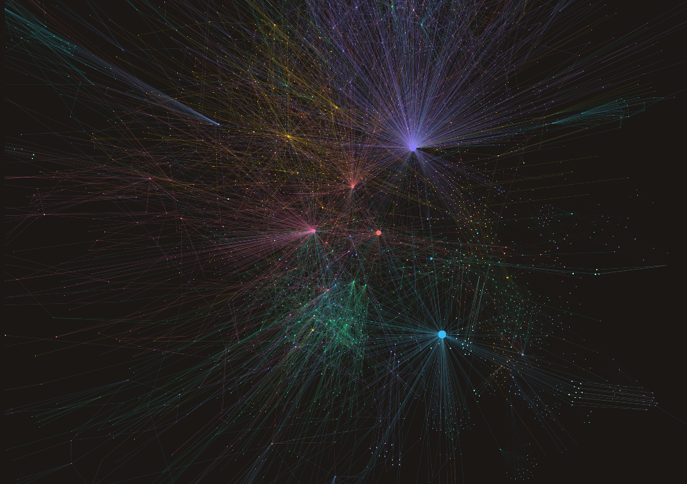

# DUIN

**A second brain that thinks in your notes.**

DUIN is a local-first second brain for people who think in notes. Point it at a folder of
Markdown and it builds a causal knowledge graph you can ask questions of, see as a living
map, and hand to an agent that acts on your files with your approval. Every answer is
grounded in your own notes and shows which notes it stood on. DUIN forecasts how open
threads converge, and it learns your judgment over time. It runs on your machine, and you
choose which model, if any, it talks to.

[](https://github.com/Mentis-lab/DUIN/actions/workflows/ci.yml)
[](https://github.com/Mentis-lab/DUIN/releases/latest)
[](LICENSE)

**Status: 0.9 — first public release, expect rough edges.**

<p align="center">
  
</p>
<p align="center"><sub>A real vault of roughly 1,200 notes as DUIN sees it. The two captures below are from the fictional sample vault.</sub></p>
<p align="center">
  
  
</p>


---

## Why DUIN

- **Grounded answers with citations.** Retrieval runs on your machine: the embedding and
  reranking encoders (`multilingual-e5-small`, `bge-reranker-base`, quantized ONNX) ship inside
  the installers. Retrieval is a visible `search_notes` call, answers cite the notes they used,
  and an evidence gate refuses to answer from thin evidence instead of guessing.
- **A graph you can see.** Your notes become a causal graph of people, projects, decisions and
  topics, drawn as a 2D map and an orbitable 3D field. Foresight engines track open loops,
  predicted risks and where converging threads meet. Click a node to open a chat scoped to it.
- **An agent with real tools.** Files, shell, MCP servers, skills, hooks and subagents, under a
  capability allowlist and approval gates. A `preToolUse` hook can veto any call. Shell
  commands, deletes, moves and writes outside your vault ask you first.
- **Autonomy is earned, not assumed.** Background loops, automations and unattended model
  passes ship off. Each has a switch in Settings, and the agent widens what it may do on its
  own only as it earns it: per-action review, a rule-of-two floor, and cost ceilings.
- **Works without a key.** With no model connected, DUIN answers from your notes (search plus
  its own insights). Connect a key for OpenAI, Anthropic, Google Gemini, DeepSeek, Moonshot,
  Zhipu, DashScope (Qwen), xAI, Mistral, Groq, DeepInfra, GitHub Models or OpenRouter, or run
  a local model through Ollama. The list of providers lives in
  `electron/services/providers/registry.ts`.
- **Three languages.** The interface ships in English, Chinese and Japanese and follows your
  OS language.

---

## Download

Installers are on [GitHub Releases](https://github.com/Mentis-lab/DUIN/releases/latest). They
are large (several hundred MB) because the on-device encoders are bundled, so search works
offline from the first launch.

| Platform | File | Notes |
| --- | --- | --- |
| **Windows** (x64) | `DUIN-x64.exe` | Per-user NSIS installer, no admin needed. **Unsigned**: SmartScreen shows a warning on first run. Choose **More info → Run anyway**. |
| **macOS** (Apple Silicon) | `DUIN-arm64.dmg` | Ad-hoc signed, not notarized. The first time, right-click the app and choose **Open** to get past Gatekeeper. |
| **Linux** (x64) | `.AppImage` / `.deb` | Produced by CI but not yet tested by the maintainers. Reports welcome. |

**Verify a download.** Each release attaches `latest.yml` (Windows), `latest-mac.yml` and
`latest-linux.yml`; the `sha512` field is the base64-encoded SHA-512 of each file. Compute
yours and compare:

```powershell
# Windows (PowerShell)
[Convert]::ToBase64String([Security.Cryptography.SHA512]::Create().ComputeHash([IO.File]::ReadAllBytes("$PWD\DUIN-x64.exe")))
```

```bash
# macOS / Linux
openssl dgst -sha512 -binary DUIN-arm64.dmg | base64
```

**Updates.** An installed DUIN checks GitHub Releases at launch and every six hours
(Settings → General to turn this off). Until the builds are signed, updates are notify-only:
DUIN tells you a new version exists and you download and install it yourself.

Prefer to build it yourself? See [Build from source](#build-from-source).

---

## Try it in 60 seconds

1. Install DUIN from the table above and launch it.
2. When the welcome screen asks for a folder, point it at [`examples/sample-vault`](examples/sample-vault) from a
   clone of this repository. It is a small **fictional** vault (made-up people, projects and
   decisions), so you can see the graph before committing your own notes.
3. Ask a question about the notes in the chat. No key is needed: DUIN answers from the notes
   it indexed.
4. Open the **Brain** tool. With no model connected you see the notes and their links. Connect
   a model and DUIN extracts people, projects, decisions and relations into the graph.

## Use it with your own notes

1. **Install** DUIN and launch it.
2. **Choose a notes folder.** Any folder of Markdown works, including an empty one. DUIN
   writes four foundation files (`ME.md`, `BRAIN.md`, `SOUL.md`, `GOALS.md`) and two dot
   folders (`.brain/`, `.duin/`) into it. Everything it keeps is plain text you can read and
   edit.
3. **Optional: connect a model.** Settings → API Keys, or the "Connect a model" button on the
   ready screen. Keys are stored in the OS keychain. Once a key is saved, DUIN builds the
   entity graph from your notes in the background. This takes minutes on a large vault.
4. **Ask your first question.** Keyless, you get an extractive answer from your notes. With a
   key, you get a conversational answer that cites them.

The step-by-step walkthrough, including what lands on disk, is in
[docs/getting-started.md](docs/getting-started.md).

---

## Build from source

Requirements:

- **Node.js 22.12 or newer** and npm.
- **git**.
- **Windows:** clone into a short path (for example `C:\src\DUIN`) or enable long paths
  (`LongPathsEnabled`). Deep `node_modules` trees exceed `MAX_PATH` otherwise.
- **Disk:** about 4 GB free for a full installer build (`node_modules` ~1.5 GB, Electron
  ~110 MB, bundled models ~412 MB, `dist/` ~2.3 GB).
- **Optional, for contributors who rebuild native modules:** Python 3 and a C/C++ toolchain
  (Visual Studio Build Tools, Xcode Command Line Tools, or `build-essential`). A plain
  `npm run setup` does not need them: it installs with scripts disabled and uses the prebuilt
  `better-sqlite3` binding (a plain `npm ci` triggers a no-op native build that still wants Python).

```bash
git clone https://github.com/Mentis-lab/DUIN
cd DUIN
npm run setup        # npm ci --ignore-scripts + the Electron binary; no Python or C++ needed
npm run dev          # launch the app in development
```

To run a second DUIN beside an installed one (for development or QA), give it its own state:
`DUIN_USER_DATA_DIR=<dir>` (user data) and `DUIN_BRAIN_PORT=8899` (its brain then listens there
instead of `8799`), then point that instance at its own brain in Settings → Brain (URL
`http://127.0.0.1:8899/agui`); the renderer's default stays `8799`. `BF_DEBUG_PORT=9444` adds
DevTools over CDP.

Check and build:

```bash
npm run typecheck    # both tsc projects
npm run lint         # eslint
npm test             # vitest
npm run build        # electron-vite build → ./out (no installer)
```

Build an installer:

```bash
node scripts/fetch-bundled-models.mjs   # ~412 MB of encoders, once (cached)
npm run build:win                       # NSIS installer + zip → ./dist
npm run build:mac                       # dmg + zip
npm run build:linux                     # AppImage + deb
```

Skipping `fetch-bundled-models.mjs` produces a smaller installer that downloads the encoders
from Hugging Face on first run. Git hooks are opt-in (`npm run hooks:install`); see
[CONTRIBUTING.md](CONTRIBUTING.md).

---

## Privacy and cloud usage

- **Your notes stay where they are**, as Markdown. DUIN keeps its index, conversations and
  settings in the app's user-data directory and writes its own state into your vault under
  `.brain/` and `.duin/` (see [docs/getting-started.md](docs/getting-started.md#7-where-things-live)).
- **Embedding and reranking run on your machine.** There is no telemetry, and crash reports
  are not uploaded.
- **Without a key**, the only network traffic is the update check against GitHub Releases
  (Settings → General to disable) and, if your build lacks the bundled encoders, a one-time
  model download from Hugging Face.
- **When you connect a key, your question plus relevant note excerpts go to that provider**
  on every turn. DUIN's own background work uses the same provider: extracting entities from
  your notes to build the graph, and generating titles if you turn that on. Vault-wide passes
  and recurring loops are gated: DUIN asks before the first vault-wide extraction, and the
  recurring loops stay off until you enable Background autonomy in Settings → Loops. A keyed
  turn is several model calls (answer, retrieval agent, extraction), so expect real usage on a
  metered account.
- **Web search** (`web_search`) queries DuckDuckGo only when the model calls the tool.
- **The agent asks before it acts.** Shell commands, deletes, moves and writes outside the
  vault prompt for approval. Full computer access (Settings → General, off by default) removes
  those prompts for local operations. The threat model is in [SECURITY.md](SECURITY.md).

---

## Documentation

- [Getting started](docs/getting-started.md): first run, step by step.
- [Architecture](docs/architecture.md): the three processes, the brain server on
  `127.0.0.1:8799`, storage layout, providers, skills, MCP, and the AG-UI contract for
  connecting an external brain (the default endpoint is `http://127.0.0.1:8799/agui`;
  `DUIN_BRAIN_URL` points DUIN at another AG-UI server).
- [Skills](docs/skills.md): how skills are authored, loaded and rendered.
- [FAQ](docs/faq.md): unsigned builds, offline use, model downloads, common build errors.
- [What DUIN is](docs/constitution.md) and the [glossary](docs/glossary.md).
- [Security policy](SECURITY.md), [contributing](CONTRIBUTING.md),
  [changelog](CHANGELOG.md), [releasing](docs/RELEASING.md).

---

## Contributing

Bug reports, fixes and documentation improvements are welcome. Read
[CONTRIBUTING.md](CONTRIBUTING.md) for the setup, the checks every PR must pass, and the PR
size guidance. Security issues go through
[private vulnerability reporting](https://github.com/Mentis-lab/DUIN/security/advisories/new),
not public issues.

---

## Attribution

DUIN started from [lamprey-harness](https://github.com/USS-Parks/Lamprey-Harness) by Basho
Parks (MIT). The agent shell, chat UI, skills and MCP plumbing, and the Electron build pipeline
began there. DUIN adds the in-process brain, the knowledge graph and its console, grounding,
memory, foresight and governance. Some on-disk and environment identifiers still carry the
`lamprey` name; they are listed in [docs/legacy-names.md](docs/legacy-names.md).

## License

MIT. See [LICENSE](LICENSE) and [NOTICE](NOTICE). Third-party notices for bundled models and
libraries ship with the installers.
