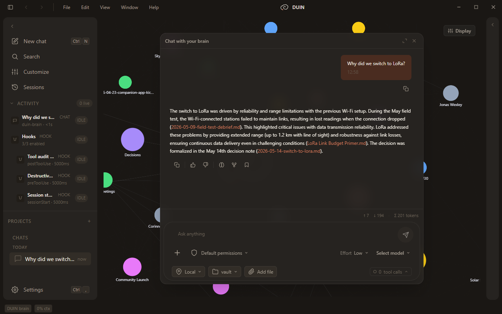
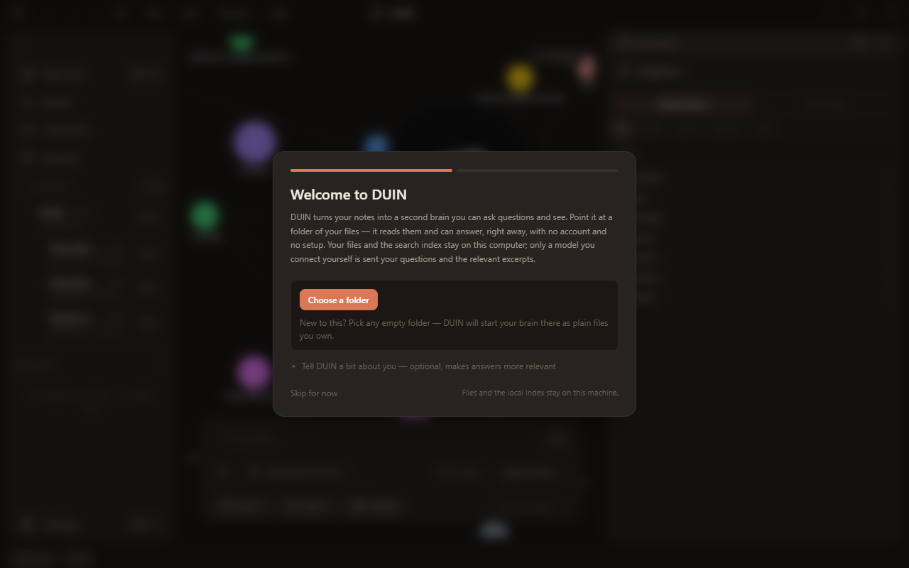

# DUIN

### A local-first second brain: turn a folder of Markdown notes into a knowledge graph you can ask, see, and hand to an agent.

<p align="center">
  <a href="https://github.com/Mentis-lab/DUIN/releases/latest"><b>Download</b></a> ·
  <a href="docs/getting-started.md">Getting started</a> ·
  <a href="docs/faq.md">FAQ</a> ·
  <a href="docs/architecture.md">Architecture</a> ·
  <a href="https://github.com/Mentis-lab/DUIN/discussions">Discussions</a> ·
  <a href="https://github.com/Mentis-lab/DUIN/issues/new/choose">Report a bug</a> ·
  <a href="SECURITY.md">Security</a>
</p>

<p align="center">
  <a href="https://github.com/Mentis-lab/DUIN/actions/workflows/ci.yml"></a>
  <a href="https://github.com/Mentis-lab/DUIN/releases/latest"></a>
  <a href="LICENSE"></a>
</p>

<p align="center">
  
</p>
<p align="center"><sub>DUIN with a real vault of roughly 1,200 notes.</sub></p>

DUIN is a desktop app for people who think in Markdown. Point it at a folder of notes and it
indexes them on your machine, draws the people, projects and decisions in them as a graph, and
answers questions with citations to the notes it used. Connect a model when you want
conversation and an agent that can act on your files; shell commands, deletes, moves and writes
outside your vault ask you first.

**Status: 0.1, first public release. Expect rough edges.** The known ones, and what is planned
for each: [#10](https://github.com/Mentis-lab/DUIN/issues/10).

---

## Download

<p align="center">
  <a href="https://github.com/Mentis-lab/DUIN/releases/latest/download/DUIN-x64.exe"></a>
  <a href="https://github.com/Mentis-lab/DUIN/releases/latest/download/DUIN-arm64.dmg"></a>
  <a href="https://github.com/Mentis-lab/DUIN/releases/latest/download/DUIN-x86_64.AppImage"></a>
</p>

Also: [`DUIN-amd64.deb`](https://github.com/Mentis-lab/DUIN/releases/latest/download/DUIN-amd64.deb)
and [`DUIN-arm64.zip`](https://github.com/Mentis-lab/DUIN/releases/latest/download/DUIN-arm64.zip).

No account. No key needed to start. Your notes and the search index stay on this machine.
Installers are large because the on-device search encoders are bundled, so search works
offline from the first launch.

**Unsigned builds, for now.** Windows shows a SmartScreen warning: choose **More info → Run
anyway**. macOS: right-click the app and choose **Open** the first time. Linux builds come from
CI and have not yet been run by the maintainers. How to verify a download, and how updates
work: [docs/getting-started.md](docs/getting-started.md#9-verify-a-download).

## Try it in 60 seconds

1. Install DUIN and launch it.
2. Download [`DUIN-sample-vault.zip`](https://github.com/Mentis-lab/DUIN/releases/latest/download/DUIN-sample-vault.zip),
   a small fictional studio's notes (3 projects, 8 people, 6 decisions), and unzip it anywhere.
   Any folder of Markdown works just as well.
3. When the welcome screen asks for a folder, choose that folder.
4. Ask: **Why did we switch to LoRa?** · **What is blocking the community launch?** ·
   **Who owns the enclosure redesign?** No key needed; the answers cite the notes they stood on.
5. Open **Brain** to see the notes as a map. Connect a model (Settings → API Keys, or a running
   Ollama) and DUIN extracts the people, projects and decisions into the graph.

<p align="center">
  
  
</p>
<p align="center"><sub>The fictional sample vault: an answer with its three citations through a local Ollama model, and the first-run screen.</sub></p>

## Why DUIN

<table>
<tr><td><b>Answers you can check</b></td><td>Every answer cites the notes it used. Retrieval and reranking run on your machine with bundled encoders. If your notes do not cover the question, DUIN says so instead of guessing.</td></tr>
<tr><td><b>A graph you can see</b></td><td>People, projects, decisions and topics from your notes, as a 2D map and a 3D field. Open loops, predicted risks and converging threads are tracked over time. Click a node to chat about it.</td></tr>
<tr><td><b>An agent that asks first</b></td><td>Files, shell, MCP servers, skills, hooks and subagents. Shell commands, deletes, moves and writes outside your notes prompt for approval.</td></tr>
<tr><td><b>Autonomy is earned</b></td><td>Background loops and unattended model passes ship off. Each has a switch in Settings, and the agent widens what it may do on its own only as it earns it.</td></tr>
<tr><td><b>Works without a key</b></td><td>With no model connected, DUIN answers from your notes. Connect a key for OpenAI, Anthropic, Google Gemini, DeepSeek, Moonshot, Zhipu, DashScope (Qwen), xAI, Mistral, Groq, DeepInfra, GitHub Models or OpenRouter, or run a local model through Ollama.</td></tr>
<tr><td><b>Your files, your language</b></td><td>Plain Markdown in a folder you own. An Obsidian vault is a valid folder: wikilinks resolve. DUIN adds four Markdown files in the root plus its own state folders (<code>.brain/</code>, <code>.duin/</code>, <code>.trash/</code>, <code>_agui_outputs/</code>), all plain text you can ignore in sync or git. Interface in English, Chinese and Japanese.</td></tr>
</table>

## What DUIN is, and is not

- It reads a folder of Markdown you already have. Keep editing it with Obsidian or any editor;
  DUIN keeps its own state in `.brain/` and `.duin/`.
- It is a second brain with an agent attached, not a coding agent with notes attached. The
  graph, the grounding and the memory are the product.
- It is local-first, not offline-only. Search and the note graph work with no key. Entity
  extraction and conversational answers need a model: a cloud key or a local Ollama.
- It is single-user. No sync, no team space, no server mode. Nothing listens beyond `127.0.0.1`.

## Known limitations in 0.1

- Installers are unsigned; updates are notify-only until signing lands.
- Linux builds come from CI and have not been run by the maintainers.
- With a key connected, one turn is several model calls, and the first graph build reads the
  whole vault. Start with a small model or a free tier.
- Slow local models can trip the 90 s idle budget (`DUIN_TURN_STALL_MS` raises it).
- The conversation database is not encrypted. Use disk encryption.

The full list, with what is planned for each: [#10](https://github.com/Mentis-lab/DUIN/issues/10).

## Use it with your own notes

1. Choose any folder of Markdown, including an empty one. DUIN writes four foundation files
   (`ME.md`, `BRAIN.md`, `SOUL.md`, `GOALS.md`) and two dot folders (`.brain/`, `.duin/`) into it.
   Everything it keeps is plain text you can read and edit.
2. Optional: connect a model in Settings → API Keys, or run Ollama. Keys are stored encrypted with
   the OS credential store (Keychain, DPAPI, Secret Service). Once a key is saved, DUIN offers to
   build the entity graph from your notes; that sends your notes to the provider in batches and
   takes minutes on a large vault.
3. Ask your first question. Keyless, you get an extractive answer from your notes. With a key,
   a conversational answer that cites them.

The step-by-step walkthrough, including what lands on disk:
[docs/getting-started.md](docs/getting-started.md).

## Privacy and cloud usage

- Your notes stay where they are, as Markdown. DUIN keeps its index, conversations and settings in
  the app's user-data directory and its own state in your vault under `.brain/` and `.duin/`.
- Embedding and reranking run on your machine. There is no telemetry, and crash reports are not
  uploaded.
- Without a key, the only network traffic is the update check against GitHub Releases
  (Settings → General to disable) and, if your build lacks the bundled encoders, a one-time
  model download.
- When you connect a key, your question plus relevant note excerpts go to that provider on every
  turn, and DUIN's graph building sends your notes to it in batches. DUIN asks before the first
  vault-wide extraction; recurring loops stay off until you enable Background autonomy.
- The agent asks before it acts. Full computer access (Settings → General, off by default)
  removes those prompts for local operations. The threat model: [SECURITY.md](SECURITY.md).

## Build from source

Node.js 22.12 or newer and git. On Windows, clone into a short path or enable long paths.

```bash
git clone https://github.com/Mentis-lab/DUIN
cd DUIN
npm run setup        # npm ci --ignore-scripts + the Electron binary; no Python or C++ needed
npm run dev          # launch the app in development
npm run typecheck && npm run lint && npm test
npm run build:win    # or build:mac / build:linux → ./dist (fetches ~412 MB of encoders once)
```

Contributor setup, running a second DUIN beside an installed one, and the checks CI runs:
[CONTRIBUTING.md](CONTRIBUTING.md).

## Documentation

- [Getting started](docs/getting-started.md): first run, step by step; verifying a download; updates.
- [Architecture](docs/architecture.md): the three processes, the brain server on
  `127.0.0.1:8799`, storage layout, providers, skills, MCP, and the AG-UI contract for
  connecting an external brain (default endpoint `http://127.0.0.1:8799/agui`; `DUIN_BRAIN_URL`
  points DUIN at another AG-UI server).
- [Skills](docs/skills.md), [FAQ](docs/faq.md), [what DUIN is](docs/constitution.md),
  [glossary](docs/glossary.md).
- [Security policy](SECURITY.md), [contributing](CONTRIBUTING.md), [changelog](CHANGELOG.md),
  [releasing](docs/RELEASING.md).

## Community

- Questions: [Discussions → Q&A](https://github.com/Mentis-lab/DUIN/discussions/categories/q-a).
- Ideas and votes: [Discussions → Ideas](https://github.com/Mentis-lab/DUIN/discussions/categories/ideas).
- Bugs: [Issues](https://github.com/Mentis-lab/DUIN/issues/new/choose). Security:
  [private report](https://github.com/Mentis-lab/DUIN/security/advisories/new).
- What is planned: [#10](https://github.com/Mentis-lab/DUIN/issues/10).

There is no Discord yet: one maintainer, and Discussions stay searchable. If DUIN is useful to
you, a star helps others find it.

## Contributing

Bug reports, fixes and documentation improvements are welcome. Read
[CONTRIBUTING.md](CONTRIBUTING.md) for the setup, the checks every PR must pass, and the PR
size guidance.

## Attribution

DUIN started from [lamprey-harness](https://github.com/USS-Parks/Lamprey-Harness) by Basho
Parks (MIT). The agent shell, chat UI, skills and MCP plumbing, and the Electron build pipeline
began there. DUIN adds the in-process brain, the knowledge graph and its console, grounding,
memory, foresight and governance. Some on-disk and environment identifiers still carry the
`lamprey` name; they are listed in [docs/legacy-names.md](docs/legacy-names.md).

## License

MIT. See [LICENSE](LICENSE) and [NOTICE](NOTICE). Third-party notices for bundled models and
libraries ship with the installers.
