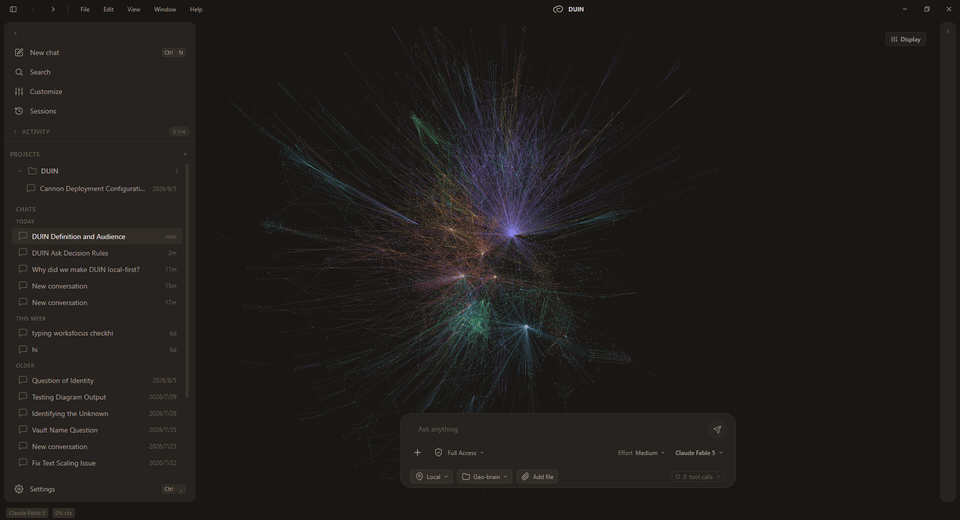
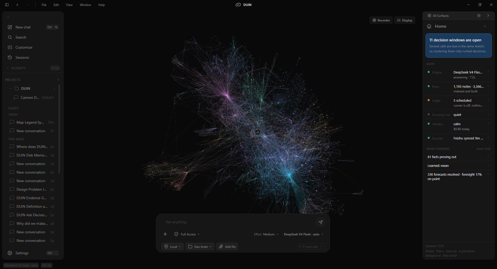

# DUIN

[English](README.md) · **简体中文** · [日本語](README.ja.md)

### 赢得你信任的智能体。

**你运行的每一个智能体，都在自己写记忆、自己给判断力打分、自己申请权限。DUIN 是一个智能体框架（harness），让这三样都必须靠实绩赢得，而且全部落在你自己的文件里。**

DUIN 是一个面向个人智能体的开放框架：长期记忆、一个关于你所处世界的动态模型，以及智能体可以做什么的规则，全部以 Markdown 存放在你自己的文件夹里，每一步都受治理。记忆和自主权都要赢得：每条事实在写下时就被标注成「你说的」或「模型推断的」，要经过若干次会话的考察才能成为规则；智能体在动到笔记之外的东西前会先问你。本地运行，MIT 许可，无需账号。

[下载](https://github.com/Mentis-lab/duin-governed-agent-memory/releases/latest) · [这个框架](#这个框架) · [与 Claude Code 配合](#和你已经在用的智能体一起用) · [快速上手](docs/getting-started.md) · [架构](docs/architecture.md) · [常见问题](docs/faq.md) · [讨论区](https://github.com/Mentis-lab/duin-governed-agent-memory/discussions) · [安全](SECURITY.md)

[](https://github.com/Mentis-lab/duin-governed-agent-memory/actions/workflows/ci.yml)
[](https://github.com/Mentis-lab/duin-governed-agent-memory/releases/latest)
[](LICENSE)

<p align="center">
  
</p>
<p align="center"><sub>作者本人的笔记库，约 1,200 条笔记，实录：把大脑图谱缩进去又拉出来，在探索面板筛出一篇 DUIN 笔记并打开，然后就着它的上下文提问——输入框会标出<em>就着上下文提问</em>，答案就落在那篇笔记上。回答由 DeepSeek V4 Flash 生成；本段录制中图谱标签已关闭。</sub></p>

**0.1，首个公开版本。** 粗糙的地方和各自的计划：[#10](https://github.com/Mentis-lab/duin-governed-agent-memory/issues/10)。接下来：带自动更新的签名安装包、可自定义的 Ollama 端点、单轮花费上限。

---

## 你会得到什么

| 能力 | 它做什么 | 需要什么 |
|---|---|---|
| **配得上位置的记忆** | 每条事实都被标注成「你说的」或「模型推断的」，经过若干次会话的检验，被取代时保留完整历史。你可以核准、否决或让它复位；你陈述过的事实，模型推翻不了。 | 什么都不需要 |
| **可核查的回答** | 溯源回答会引用它依据的笔记，证据不足时会拒绝作答。 | 什么都不需要 |
| **你的文件还是你的** | 就是你自己文件夹里的纯 Markdown；Obsidian 笔记库可以直接用。DUIN 从不改动你已有的笔记。 | 什么都不需要 |
| **一张你正在做什么的地图** | 人、项目、决策和未了的线索，抽成一张可以探索的图谱，未闭合的循环会被长期跟踪。 | 接一个模型 |
| **有手，但拴着绳的智能体** | 文件、命令、MCP 服务器、技能、钩子和子智能体。笔记之外的一切都要先问你，后台循环默认关闭。 | 接一个模型 |
| **一份记忆，所有智能体共用** | Claude Code 或任何 MCP 客户端，挂载的都是同一份记忆和地图，逐个权限面批准。 | 你的授权 |

**检索全部在你的机器上：** BM25 走一套认得中日文的分词器，向量存在 sqlite-vec 里、用 multilingual-e5-small 做嵌入，两路用加权倒数排名融合合并，最后再过一遍 bge-reranker-base 交叉编码器。不需要密钥，不需要服务器，不需要显卡。

**什么都不需要**指的是不用密钥、不用账号：检索、溯源回答和记忆本身，第一次启动就能用。**接一个模型**指的是 OpenAI、Anthropic、Google Gemini、DeepSeek、月之暗面、智谱、DashScope（通义千问）、xAI、Mistral、Groq、DeepInfra、GitHub Models、OpenRouter，或者通过 Ollama 接一个本地模型；一个都没接时，由你自己核准来代替评审团。DUIN 只在你的文件夹根目录加四个 Markdown 文件，自己的状态放在 `.brain/`、`.duin/`、`.trash/` 和 `_agui_outputs/` 里，都是纯文本，你可以在同步或 git 里忽略掉。界面支持英文、中文和日文。

<p align="center">
  
</p>
<p align="center"><sub>DUIN 运行在作者本人的笔记库上，约 1,200 条笔记。右侧面板是<strong>主页</strong>，也就是启动时默认打开的那个面板。</sub></p>

## DUIN 是什么，不是什么

- 它是一个治理智能体的记忆、判断力和自主权的框架，不是一个带记忆文件的编程智能体。智能体外壳被刻意做薄了；治理才是产品。
- 它读的是你本来就有的那个 Markdown 文件夹。你继续用任何编辑器改它；DUIN 从不改动你已有的笔记。
- 它是本地优先，不是仅限离线。检索、溯源回答和记忆不用密钥就能跑。抽取、对话和评审团需要模型：云端密钥或本地 Ollama。
- 它是单用户的。没有同步、没有团队空间、没有服务端模式、没有 SDK。除了 `127.0.0.1`，没有任何东西对外监听。

## 这个框架

智能体通常自己说了算的三件事。在 DUIN 里，每一件都受治理、看得见，并且保存在你自己的文件中。

### 记忆：事实要赢得，不是追加进去

一般的框架把自己认定的内容追加进一个记忆文件，然后再读回来。DUIN 让每条事实都走一遍流程，这个流程在「学习」面板和你的笔记库里都看得见：

- **写入时即标注。**「记住，我喜欢回复先给结论」会被记成你说的；模型从你的对话里推断出来的，会被记成推断的。标签在事实创建时就打上，之后绝不回填。
- **先进试用期。** 新事实先弱接地，同时要经过若干次会话的检验和一次独立复核：接了模型，就由另一个模型组成的评审团来判；没接，就等你核准。没通过的事实会被回退。
- **规则就是一个文件。** 确认过的事实会成为 `.brain/memory/` 下的一个概念文件，带有状态、来源、日期和来源链。改写它的断言行，DUIN 会把你的版本记成一条取代旧版的陈述；删掉这个文件，这条事实就撤回了。
- **只被取代，绝不覆盖。** 被推翻的事实会连同指向替代者的指针一起退役，文件移入 `.brain/_retired/`，你随时可以让它复位。
- **你说的算数。** 你陈述过的事实，模型不会自作主张地退役、修剪或重新标注。

其中一个文件长这样：

```yaml
---
id: concept-of_12_k9a
name: 偏好先给结论的回复
description: "偏好先给结论、再给依据的回复。"
type: learned
metadata:
  kind: preference
  factId: of_12_k9a
  status: promoted          # candidate 候选 → provisional 试用中 → promoted 已转正
  source: operator          # 你说的；模型永远无权改写这条事实
  adjudicatedBy: human      # 你核准的
  capturedAt: 1787115440387
  promotedAt: 2026-08-19
  supersedes: [of_7_c2q]    # 被它取代的那条事实；文件在 .brain/_retired/
tags: [preference, promoted, learned]
---
```

### 判断力：一个关于你的世界的模型，而不是塞进提示词的一团文本

- DUIN 从你的笔记和它学到的东西里，把你工作中的人、项目、决策和未了的线索抽成一张可探索的图谱，并随你的书写保持更新。未闭合的循环和正在收敛的线索会被长期跟踪。
- 抽取出的断言带有生效时间和失效时间、一个判定和判定理由。模型提出的退役只在置信度达标时才会生效，并且会明确告诉你是已应用还是被拦下；你对它的裁定会成为一枚图钉，此后每一轮都不会被推翻。大脑可以回答「某个日期当时相信的是什么」。
- 决策带有复盘日期和你自己对它的裁定，所以这份记录会说明后来哪些是对的。
- 回答会引用它所依据的笔记；当笔记里的证据不足时，DUIN 会直说，而不是把空缺填上。检索和重排序都在你的机器上跑；除了构建图谱的抽取之外，这一切都不需要任何密钥。

### 自主权：一级级赢得，由你授予

- 智能体会编辑文件、执行命令，也会使用 MCP 服务器、技能、钩子和子智能体。shell 命令、删除、移动，以及任何笔记之外的动作，都会先问你。
- 周期性自动化和后台循环出厂即关闭，由你逐个打开。打开之后，框架对自身设置提出的改动会先待核准，直到你核准；跑偏的运行会触发熔断，只有你能重新启用。
- 从通道进来的消息永远不携带执行令牌，从外部教进来的事实会被隔离，直到你采纳它。
- 别的智能体通过 MCP 挂载 DUIN。每个智能体能读什么、能写什么，都是你在应用里逐个权限面批准的授权，而且可以比它申请的更窄。
- 边界是审批弹窗和操作系统自己的对话框，不是沙箱。它能防住什么、防不住什么，写在 [SECURITY.md](SECURITY.md) 里。

更多细节，直接来自代码：[架构](docs/architecture.md)。

## 下载

| Windows | macOS | Linux |
|---|---|---|
| [DUIN-x64.exe](https://github.com/Mentis-lab/duin-governed-agent-memory/releases/latest/download/DUIN-x64.exe) | [DUIN-arm64.dmg](https://github.com/Mentis-lab/duin-governed-agent-memory/releases/latest/download/DUIN-arm64.dmg) | [DUIN-x86_64.AppImage](https://github.com/Mentis-lab/duin-governed-agent-memory/releases/latest/download/DUIN-x86_64.AppImage) |

还有 [DUIN-amd64.deb](https://github.com/Mentis-lab/duin-governed-agent-memory/releases/latest/download/DUIN-amd64.deb) 和 [DUIN-arm64.zip](https://github.com/Mentis-lab/duin-governed-agent-memory/releases/latest/download/DUIN-arm64.zip)。

安装包体积大，是因为两个端上编码器（检索和重排序，约 412 MB）打包在里面；其余是 Electron 和应用本身。检索和溯源回答从第一次启动起就能离线工作。在你接上模型之前，不会有任何东西被发出去。不需要 GPU。

<details><summary>未签名的构建，以及如何校验下载</summary>

Windows 会弹 SmartScreen 警告：选择 **更多信息 → 仍要运行**。macOS：第一次右键点击应用并选择 **打开**。Linux 构建来自 CI，维护者尚未实际运行过。每个发布都附带 `latest.yml`、`latest-mac.yml` 和 `latest-linux.yml`，其中含每个文件的 SHA-512；校验命令和更新机制见 [docs/getting-started.md](docs/getting-started.md#9-verify-a-download)。

</details>

## 第一次运行

1. 安装 DUIN 并启动。欢迎页问你要文件夹时，选那个装着你 Markdown 笔记的文件夹。Obsidian 笔记库可以直接用；空文件夹也可以。你的笔记就是它起步的记忆。
2. 跟它说点什么：「记住，我喜欢回复先给结论。」启动后默认打开的就是主页面板（界面上标作 Home），点它底部的 **详情 → 学习**，这条事实就在那里，标注为你说的。
3. 问一件你确定自己写下过的事。什么都没配置的情况下，答案会连同它依据的笔记一起给你；或者 DUIN 告诉你笔记里的证据不足。
4. 接一个模型（设置 → API 密钥，或一个正在跑的 Ollama）。事实从此走评审团，而不是等你；**知识大脑** 会把你笔记里的人、项目和决策展示成一张地图。
5. 可选：把它挂进 Claude Code（见下文），让你本来就在用的智能体以同样的方式记住你。

每一步在磁盘上落下什么：[docs/getting-started.md](docs/getting-started.md)。

## 和你已经在用的智能体一起用

Claude Code 和 Codex 是更强的智能体，而且各自都有一个自己的记忆文件。DUIN 是它们可以共用的那份记忆，也是受治理的那一份。

- **Claude Code。** 运行 `/plugin marketplace add https://github.com/Mentis-lab/duin-governed-agent-memory`，然后 `/plugin install duin-brain@duin`。DUIN 运行时，会话就能读到你的上下文和信念（`duin_brief`、`duin_retrieve`、`duin_beliefs`、`duin_context`）；只有在你于 设置 → 智能体 里授权后，它才能教入更正或写入记忆。每一项授权都由你在应用里批准。配对流程、权限面和工具：[plugins/duin-brain/README.md](plugins/duin-brain/README.md)。已于 2026-09-02 在一份干净的 Claude Code 配置下，从本仓库验证过安装。
- **任何别的 MCP 客户端**，只要能带 bearer 头走 HTTP（包括 Codex，在其客户端允许的范围内），挂载的都是同一个端点：`http://127.0.0.1:8799/exec/mcp`。在智能体完成配对之前，这个端点只提供两个配对工具。
- **反过来也行。** DUIN 自己的对话可以由一个外部大脑通过 AG-UI 驱动（`DUIN_BRAIN_URL`），智能体也可以把任务交给另一个框架作为受治理的子进程执行（`delegate_task`），每一次工具调用仍由 DUIN 说了算。

## 和同类相比

- **智能体自带的记忆**（Claude Code 的记忆文件、`AGENTS.md`、`CLAUDE.md`）：规则要你手写，记忆由模型追加和改写，既不记录谁说的，也没有历史。DUIN 会标注、检验、取代并保留历史，而且不给模型改写你说过的话的权利。
- **智能体记忆系统**（OpenClaw、mem0、Letta）：是 SDK 和常驻运行时；记忆由模型写入，后写覆盖先写，没有来源标注。DUIN 是一个应用加一堆文件，不是一套 API；它的记忆扎根于你的笔记，带引用、按来源标注、经过若干次会话的检验，最终由你裁定。
- **编辑器插件**（Copilot for Obsidian、Smart Connections）：在编辑器里做对话和相关笔记，也支持移动端，而且更轻——Smart Connections 用几兆就跑起了本地向量，而 DUIN 要装 412 MB 的编码器。它们不保存任何关于你的、受治理的记忆。
- **本地 RAG 应用**（AnythingLLM、Khoj）：把文档导入工作区或服务端，带 Web 和移动端。DUIN 就地读你的文件夹，不需要服务端，不用密钥也能回答。
- **Reor**：一个内置 AI 检索的笔记应用。DUIN 不是编辑器；它读的是你在别处维护的笔记。

## 0.1 的已知局限

- 一条事实要被信任是要花时间的。试用期正是重点，但这也意味着你今天说的偏好会先弱接地，直到被核准或自己熬出来；想马上生效，就自己核准它。
- 召回只和普通检索持平，并没有更好：在 LongMemEval 上，两次预先登记的运行中，DUIN 总分比朴素 RAG 基线低 1.0，在时间类问题上高 7.7。测试装置和结果在 `bench/longmemeval/` 里。
- 安装包未签名；在签名落地前，更新只做提醒。
- Linux 构建来自 CI，维护者没有实际跑过。
- 接上密钥后，一轮对话是好几次模型调用，而且第一次构建图谱会读完整个笔记库。先用小模型或免费额度起步。
- 慢的本地模型可能撞上 90 秒的空闲预算（用 `DUIN_TURN_STALL_MS` 调高）。
- Ollama 固定在 `127.0.0.1:11434`，暂时不能自定义端点。
- 对话数据库没有加密。请用磁盘加密。

完整清单，以及每一项的计划：[#10](https://github.com/Mentis-lab/duin-governed-agent-memory/issues/10)。

## 运行环境

Windows x64、Apple 芯片的 macOS，以及 Linux x64（AppImage 或 deb）。不需要 GPU；编码器跑在 CPU 上。安装体积和内存占用会在参考机器上实测后公布。

## 隐私与云端调用

- 你的笔记待在原地。DUIN 把索引、对话和设置放在应用的用户数据目录里，把自己的状态放在你笔记库的 `.brain/` 和 `.duin/` 下。
- 向量化和重排序都在你的机器上跑。没有遥测。崩溃报告不会上传。
- 不接密钥时，唯一的网络请求是对 GitHub Releases 的更新检查（设置 → 通用 可关闭）；如果你的构建里没有内置编码器，还会有一次性的模型下载。
- 接了密钥后，每一轮都会把你的问题和相关笔记片段发给那个供应商，构建图谱时会分批把你的笔记发过去。第一次全库抽取前 DUIN 会先问你；周期性自动化在你打开之前都是关的。记忆的日常维护（核验事实的评审团，以及退役陈旧事实的那一遍）也会自行向同一个供应商发送简短提示词。
- 密钥通过 Electron `safeStorage` 存进操作系统自己的凭据库（macOS 的 Keychain、Windows 的 DPAPI）。
- 智能体动手之前会先问。完全计算机访问权限（设置 → 通用，默认关闭）会去掉本地操作的这些弹窗。威胁模型见 [SECURITY.md](SECURITY.md)。

## 从源码构建

Node.js 22.12 或更新版本，以及 git。Windows 上请克隆到较短的路径，或启用长路径。

```bash
git clone https://github.com/Mentis-lab/duin-governed-agent-memory
cd duin-governed-agent-memory
npm run setup        # npm ci --ignore-scripts 加上 Electron 二进制；不需要 Python 或 C++
npm run dev          # 以开发模式启动应用
npm run typecheck && npm run lint && npm test
npm run build:win    # 或 build:mac / build:linux → ./dist（会一次性拉取约 412 MB 的编码器）
```

贡献者环境搭建、在已安装版本旁边再跑一个 DUIN，以及 CI 会跑的检查：[CONTRIBUTING.md](CONTRIBUTING.md)。

## 文档与社区

- [架构](docs/architecture.md)：先讲记忆模型，再讲三个流程、跑在 `127.0.0.1:8799` 的大脑、存储，以及接入外部大脑的 AG-UI 约定（默认端点 `http://127.0.0.1:8799/agui`，用 `DUIN_BRAIN_URL` 把 DUIN 指向另一个 AG-UI 服务端） · [快速上手](docs/getting-started.md) · [技能](docs/skills.md) · [常见问题](docs/faq.md) · [DUIN 是什么](docs/constitution.md) · [术语表](docs/glossary.md) · [安全策略](SECURITY.md) · [更新日志](CHANGELOG.md) · [发布流程](docs/RELEASING.md)。
- 提问：[讨论区 → Q&A](https://github.com/Mentis-lab/duin-governed-agent-memory/discussions/categories/q-a)。想法：[讨论区 → Ideas](https://github.com/Mentis-lab/duin-governed-agent-memory/discussions/categories/ideas)。缺陷：[Issues](https://github.com/Mentis-lab/duin-governed-agent-memory/issues/new/choose)。安全：[私下报告](https://github.com/Mentis-lab/duin-governed-agent-memory/security/advisories/new)。
- 暂时没有 Discord：只有一个维护者，而讨论区可以被搜索到。如果 DUIN 对你有用，点个 star 能帮别人找到它。

## 参与贡献

欢迎缺陷报告、修复和文档改进。[CONTRIBUTING.md](CONTRIBUTING.md) 里有环境搭建、每个 PR 必须通过的检查，以及关于 PR 体量的建议。

代码是怎么写的：DUIN 由一名人类维护者带着 AI 编程智能体开发。每次改动都要过类型检查、linter、测试套件（约 10,600 个测试，都在仓库里）和一道证明门禁才能落地。这些测试就是上文所述框架行为的规格说明。

## 出处

DUIN 起步于 Basho Parks 的 [lamprey-harness](https://github.com/USS-Parks/Lamprey-Harness)（MIT）。智能体外壳、对话界面、技能与 MCP 管道，以及 Electron 构建流水线都起源于那里。DUIN 在其上加了进程内的大脑、知识图谱及其控制台、溯源、记忆、前瞻和治理。有些磁盘上和环境变量里的标识符仍带着 `lamprey` 这个名字，清单见 [docs/legacy-names.md](docs/legacy-names.md)。

## 许可

MIT。见 [LICENSE](LICENSE) 和 [NOTICE](NOTICE)。捆绑模型和第三方库的声明随安装包一起分发。
